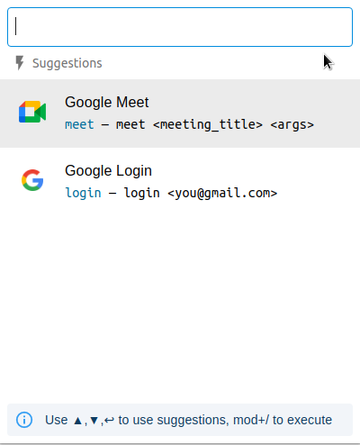

# Google Meets Extension

Based on Michael Xieyang Liu's [boilerplate](https://github.com/lxieyang/chrome-extension-boilerplate-react)

## Installing and Running

### Procedures:

1. Check if your [Node.js](https://nodejs.org/) version is >= **10.13**.
2. Clone this repository.
3. Run `npm install` to install the dependencies.
4. Run `npm start`
5. Load your extension on Chrome following:
   1. Access `chrome://extensions/`
   2. Check `Developer mode`
   3. Click on `Load unpacked extension`
   4. Select the `build` folder.

## Packing

After the development of your extension run the command

```
$ NODE_ENV=production npm run build
```

Now, the content of `build` folder will be the extension ready to be submitted to the Chrome Web Store. Just take a look at the [official guide](https://developer.chrome.com/webstore/publish) to more infos about publishing.

## Secrets

Secrets are to be stored in `./secrets.<THE-NODE_ENV>.js`. They can simply be imported by module named `secrets`. This extension requires only one secret `googleApiClientId` with the following scopes **['openid',
'email',
'profile',
'https://www.googleapis.com/auth/calendar']**

_./secrets.development.js_

```js
export default { googleApiClientId: '123' };
```

## Screenshot



## Resources:

- [Webpack documentation](https://webpack.js.org/concepts/)
- [Chrome Extension documentation](https://developer.chrome.com/extensions/getstarted)

---

Project by: Snehal Baghel
